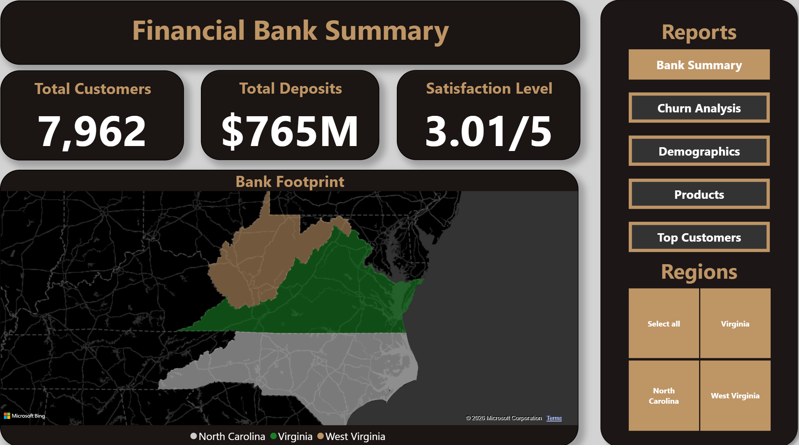
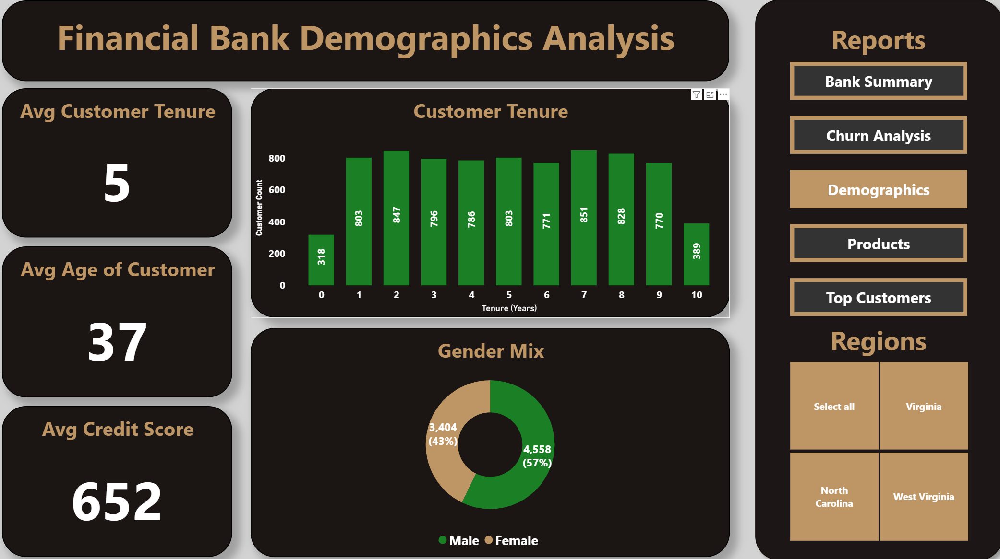
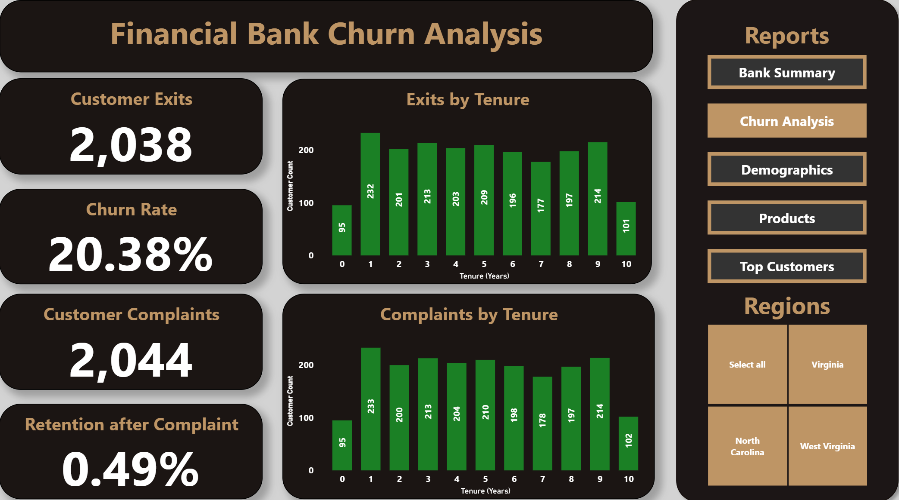
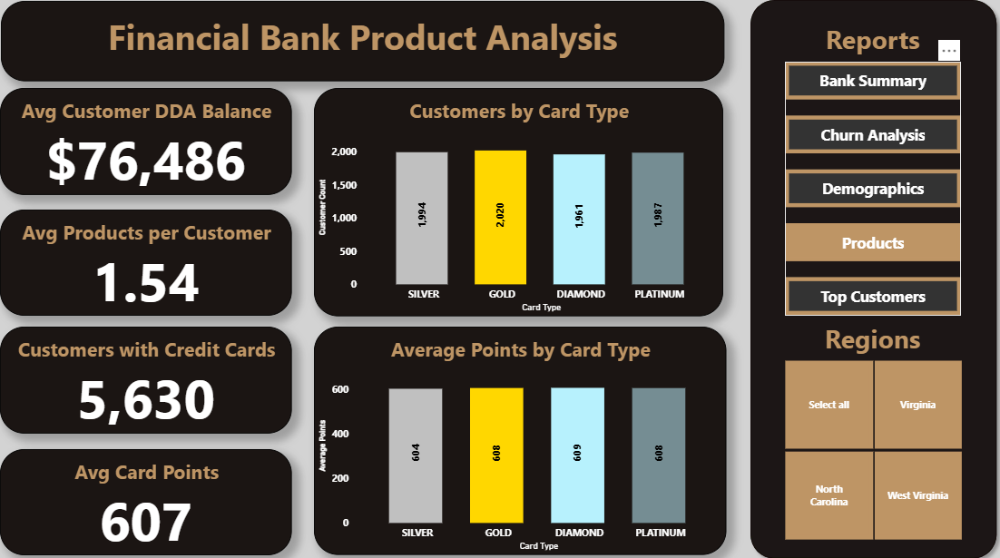
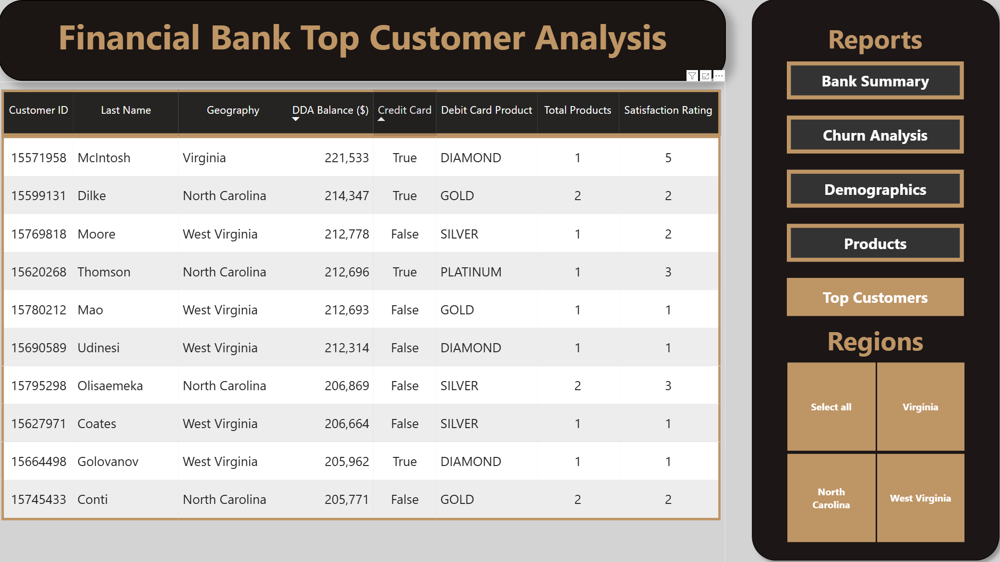

# Bank Dashboard Project

## Introduction
Working in finance and data provides a visual of what people on the outside may not see - the hidden patterns inside the customer numbers. Every transaction, balance, and customer interaction is carefully recorded, which builds bits and pieces of the bank's story.

Banks and other financial institutions rely on various simple yet impactful calculations and reports to understand customers (both active customers and those that have exited). From an analytics perspective, piecing together different information about the customers and their data will help management understand their customers and how to improve the bank's performance.

## Background
This project takes a dataset of 10,000 bank customers' financial behavior, demographics, product engagement, and satisfaction (dataset provided by [Radheshyam Kollipara](https://www.kaggle.com/datasets/radheshyamkollipara/bank-customer-churn)). The goal for this project was to clean and manipulate the bank customer dataset, which was then input into a dashboard to provide actionable insight and performance. The findings are presented as more than just charts and metrics but as actionable insights bank management can see to make more impactful business decisions.

## Tools I Used

* <b> PowerBI </b> - the foundation of my project, used to take the bank data and provide actionable insights through interactive visualizations and reporting.
* <b> DAX </b> - the formula language in PowerBI used to create custom calculations and measurements such as churn rate, retention rate, and card type order rank
* <b> Python </b> - the programing language, in conjunction with the Pandas, Matplotlib, and Seaborn libraries, for data cleaning, manipulation, and visualizations.
* <b> VSCode </b> - the code editor for developing and managing the project environment.
* <b> Git and Github </b> - Essential for version control, project tracking, and collaboration.

## The Analysis
The project is broken down into five dashboard pages. Each page presents a global analysis of the bank's performance, which can be broken down based on region (West Virginia, Virginia, and North Carolina):

### <b> Bank Summary </b>

- As of our review, there appear to be 7,962 active bank customers with total deposits of $765MM
    - Our West Virginia market has the most active customers at 4,203 and total deposits at $311MM
    - It should be noted that out of the $765MM in total deposits, $186MM of the deposits derive from customers who have exited our bank
- Overall, we see a satisfaction rating of 3.01, with each region having a similar satisfaction ratings

### <b> Demographics </b>

- The average active customer has banked with us for five years with the majority banking between two and eight years
- The average age of our customers is 37, and they have an average credit score of 652 (which is below the [US Average](https://www.experian.com/blogs/ask-experian/what-is-the-average-credit-score-in-the-u-s/))
- The majority of our active customers are males

### <b> Churn Analysis </b>

- Since opening ten years ago, we have lost 2,038 customers with a churn rate of 20.38%
- The bank has recorded 2,044 customer complaints
    - There appears to be a correlation between complaints and exits
    - The bank has only been able to retain six customers that have made complaints

### <b> Product Analysis </b>

- Based on active customers, we noted the following:
    - Average deposit balance: $76,486
    - Average products per customer: 1.54
    - Customers with credit cards: 5,630
    - Average card points: 607
- There appears to be a near equal mix of card types for the active customers
- Additionally, there is an equal mix of card points for the different card types

### <b> Top Customers </b>

- Our current top customer with our bank is McIntosh with a DDA balance of $221,533
- Out of the top 10 customers, four have Diamond or Platinum debit card products
- Additionally, three have more than one product, and one has a satisfaction rating of 5

## Conclusion

This dashboard project provides the audience a visual of bank key performance trends based on different subjects such as demographics, product engagement, customer satisfaction, and other analyses bank management might find useful.